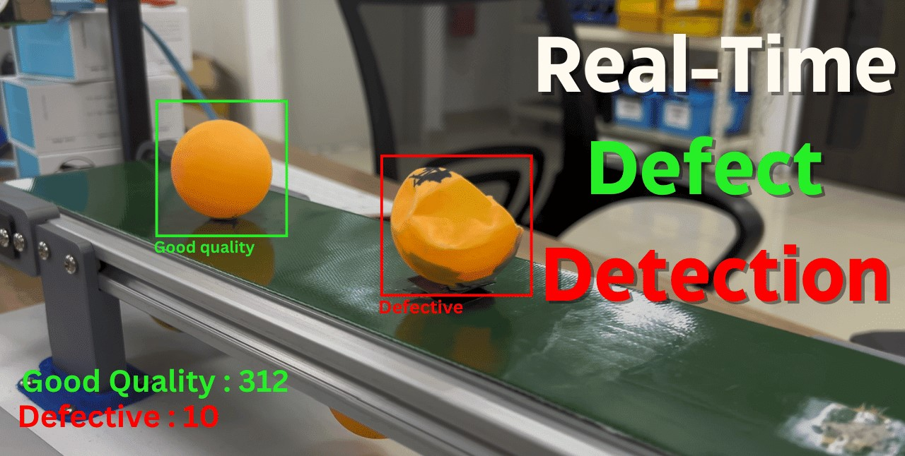
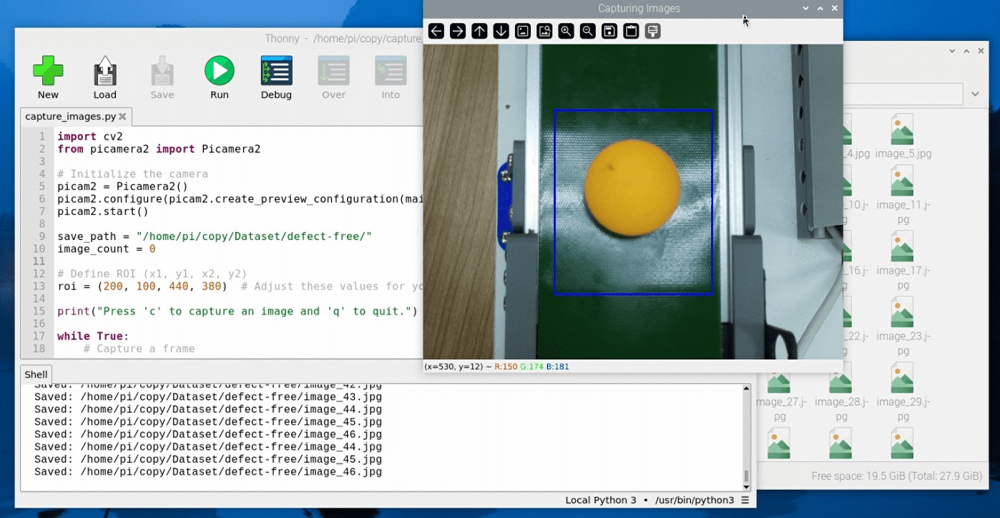
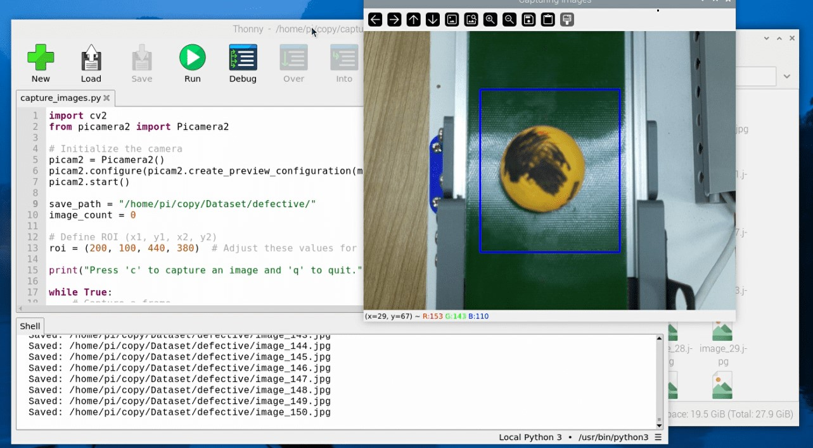
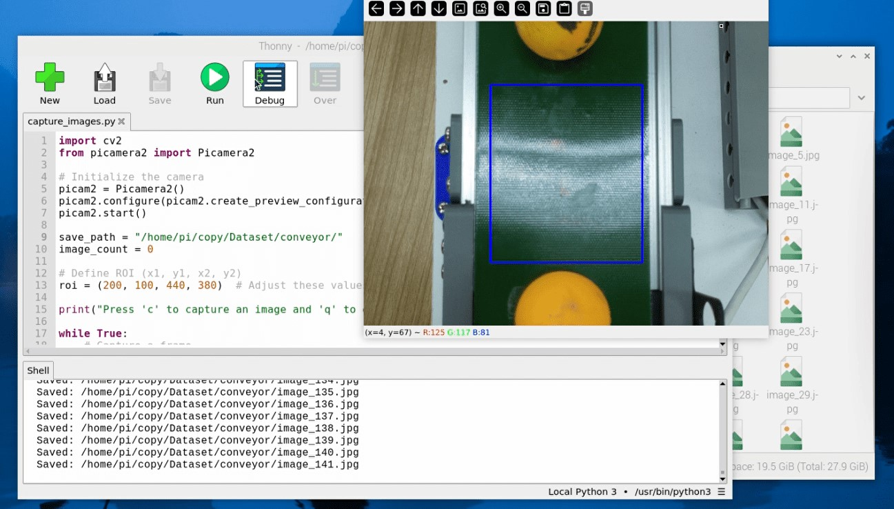

#  Defect Detection System using Raspberry Pi + Machine Learning

This project shows you how to build a **real-time defect detection system** using a Raspberry Pi, camera module, and a trained machine learning model. It classifies objects into **defect-free** or **defective** categories using image classification.

---

## 🔍 Features

- Real-time object classification: Defect-Free vs Defective  
- Uses machine learning (Random Forest)  
- Raspberry Pi Camera integration with Picamera2  
- Training from your own image dataset  
- Runs fully offline (no internet required)

---

## 🧰 Hardware Requirements

| Item | Description |
|------|-------------|
| 🧠 Raspberry Pi 5 | or Pi 4 (with camera support) |
| 📷 Raspberry Pi Camera | v2 or Camera Module 3 (12MP Autofocus) |

---

## ⚙️ Software Stack

- Raspberry Pi OS (Bookworm, 64-bit)
- Python 3.x
- OpenCV
- Scikit-learn
- Numpy, Matplotlib
- Picamera2

---

## 📂 Project Structure

```plaintext
Defect-Detection/
├── capture_images.py         # Capture images into dataset folders
├── preprocessing_data.py     # Prepare dataset for training
├── train_data.py             # Train ML model (Random Forest)
├── run_code.py               # Run real-time defect detection
└── dataset/
    ├── defect-free/
    ├── defective/
    └── conveyor/
```

## 🔧 Step-by-Step Setup

### Step 1: Install Required Libraries

```
sudo apt update && sudo apt upgrade -y
sudo apt install python3-pip libopencv-dev python3-opencv libgtk-3-dev -y
pip3 install picamera2 scikit-learn numpy matplotlib
```

### Step 2: Create Dataset Folders

```
mkdir -p /home/pi/dataset/defect-free
mkdir -p /home/pi/dataset/defective
mkdir -p /home/pi/dataset/conveyor
```
Use the [capture_images.py](Defect-Detection/capture_images.py) – Script to collect training images. Make sure you capture:
- Different lighting conditions
- Various object positions
- Balanced dataset (100–200 images/class minimum) - the higher dataset you take , more accurate your model 





### Step 3: Preprocess & Train

```
python3 preprocessing_data.py
python3 train_data.py
```

### Step 4: Run the Defect Detection System

```
python3 run_code.py
```

### Tips
- Keep the dataset balanced across classes
- Add more training samples if detection is inaccurate
- Use data augmentation to expand dataset size
